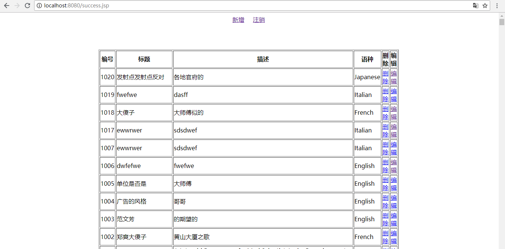

>本次考试总分 26 分
>
####要求:
>
>   -   1,(2 分)使用 maven 构建项目 ,考试完成后使用 git 提交到 github，使
用 UTF-8 编码，统一使用 JDK1.8
>

>   -   2,(2分)每个项目必须有README文件,README须清晰明了的描述如
何运行,使用项目

>  -   3.(2 分) 项目名称为 Exam-<工号>-<YYYYMMDD>-<题号>,例如,
Exam-1000-20170313-1,代表：Exam工号1000同学 2017/03/13 第
一题，注意：项目名称不要出错，否则我们将无法拿到你的项目，本
次只有一题，因此，<题号>为 1

####使用 JSP&Servlet 实现电影租赁系统的部分功能,主要的功能有:
>   -   (2 分) 1,添加/index.jsp,将本次实现在的功能链接全部显示,如点击登
录的链接后,跳转到登录页面

>>index.jsp页面

>>登陆login.jsp页面

>   -   (4 分) 2,用户登录,用户通过 login 界面输入 name,只要 name 与
customer 表的 first_name 相同,则表示登录成功,否则失败

>>登陆成功进入film列表界面

>   -   (10 分)3,实现对 film 表的列表显示,新增,删除,编辑界面

>>  -   3.1 列 表 显 示 界 面 , 显 示 所 有 的 film, 显 示 的 字 段 有
film_id,title,description,language(需要关联 language 表)

>>film界面要求film_id,title,description,language字段

>>  -   3.2 新增界面,需要有 title,description,language 字段,language
需要从选择框中选取,选择项来源于 language 表

>>新增按钮

>>点击新增按钮来到新增页面,要求有title,description,language 字段,且language需要从选择框中选取,选择项来源于 language 表

>>点击添加按钮新增一个film，返回查看，新增成功

>>  -   3.3 删除功能,在列表显示界面中,每条记录行添加一个删除链
接,用来删除记录

>>每条记录有一个删除链接，点击删除链接删除该条记录

>>删除成功，id为1023得记录被删除

>>  -   .4 编辑功能,在列表显示界面中,每条记录行添加一个编辑链
接,用来进入编辑界面 ,编辑界面需要有 title,description,language 字
段

>>每条记录添加一个编辑链接，点击编辑链接来到编辑页面，有title,description,language 字段

>>修改记录保存更新记录

>>更新成功，id为1020记录改变

>>  -   (4 分) 4,拒绝未登录用户进入系统,使用 Filter 功能,只要发现用户未登
录,则将用户请求转发到/login 要求用户登录

>>使用filter过滤未登录用户，filter业务逻辑

>>filter在web.xml里配置

>>测试在为登陆状态下访问登陆成功之后得页面

>>测试成功，没有登陆时访问会重定向到登陆页面进行登陆

说明:

1,本次考试使用的数据库为 sakila

2,数据库的用户名,密码配置需要在 README 中说明

-   本次使用MySQL数据库，配置在resources下的dbconfig.properties文件中。

            数据库名：sakila
            用户名：root
            密码：root
            
3,数据库的配置要单独放到一个文件夹下

